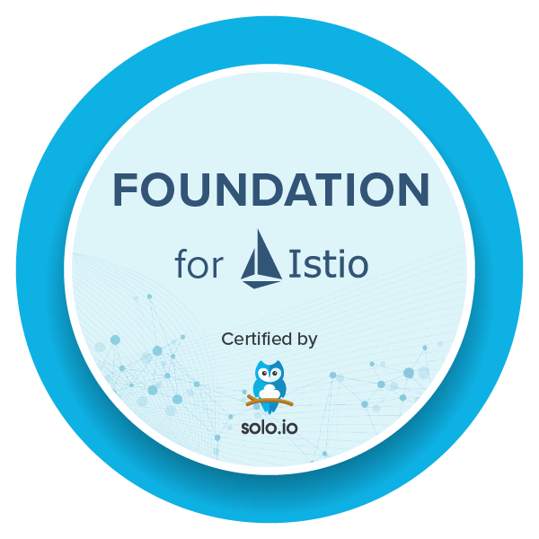

# Get Started With Istio Service Mesh

Download Labs [istio-basics.zip](./istio-basics.zip)

Microservices can be complicated and difficult to manage. These complexities have given rise to a new solution called service mesh. Istio is the most dominant service mesh in production today per a CNCF survey in late 2020. This workshop explains how to get started with Istio by incrementally adopting Istio and observing the benefits that Istio service mesh brings to you. We will explore various functions and benefits that Istio provides to your organization. We cover the following topics in this workshop:

* Install Istio
* Secure services with Istio Ingress Gateway
* Add Services to the Mesh
* Secure interservices communication with Istio
* Control Traffic

This workshop is intended for developers and operators. Anyone responsible for the delivery of microservices will find the workshop valuable. We assume you are just learning about Istio and service mesh.

This workshop also includes a certification option. This credential, offered by Solo.io with Credly, certifies that you possess the introductory skills, to install, secure services, add services to the Mesh, secure interservices communication, and control traffic. At the completion of the workshop, you will be able to take an assessment and a score 80% or higher earns the certification.



## Lab environment and prep

We will use a Kubernetes cluster offered by instruqt to run the lab. You can also use a Kubernetes cluster provided by your cloud provider or follow the instruction below to setup a Kubernetes cluster on your laptop.

### Lab environment prep on your local laptop

Alternatively, you can also run this lab on your laptop where Docker is supported. Due to a known issue with MetalLB with MacOS. If you are running this lab on MacOS, we recommend you to run a [vagrant Ubuntu VM](https://github.com/solo-io/workshops/blob/master/VAGRANT.md) on your MacOS.

### Set up Kubernetes cluster with Kind

From the terminal go to the `/home/solo/workshops/scripts` directory:

```text
cd /home/solo/workshops/scripts
```

Run the following commands to deploy a single Kubernetes cluster using [Kind](https://kind.sigs.k8s.io/):

```bash
./deploy.sh 1 istio-workshop
```


Note the `1` in the CLI command above


Kind should automatically set up the Kubernetes context for the `kubectl` CLI tool, but to make sure you're pointed to the right cluster, run the following:

```bash
kubectl config use-context istio-workshop
```

### Set up Kubernetes cluster with k3d

Run the following commands to download k3d and setup a Kubernetes cluster after you start your Docker deamon:

```text
labs/setup/setup-k3d.sh
```

You should have a working k3s cluster:

```text
kubectl get pods -A                                                     (8d22h44m) 14:27:26
NAMESPACE     NAME                                      READY   STATUS    RESTARTS   AGE
kube-system   metrics-server-86cbb8457f-d9rch           1/1     Running   0          52s
kube-system   local-path-provisioner-7c458769fb-qczf5   1/1     Running   0          52s
kube-system   coredns-854c77959c-d69qd                  1/1     Running   0          52s
```

## Start the lab!

Now go to the directory that has the workshop material:

```text
cd /home/solo/istio-workshops/istio-basics/
```

* [Lab 1 - Install Istio](01-install-istio.md)
* [Lab 2 - Secure services with Istio Ingress Gateway](02-secure-service-ingress.md)
* [Lab 3 - Add Services to the Mesh](03-add-services-to-mesh.md)
* [Lab 4 - Secure interservices communication with Istio](04-secure-services-with-istio.md)
* [Lab 5 - Control Traffic](05-control-traffic.md)

